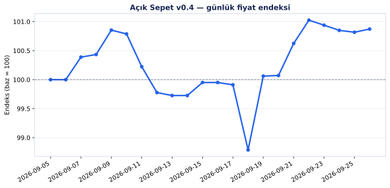
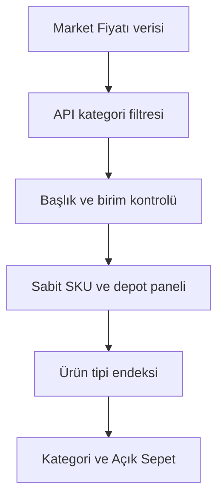
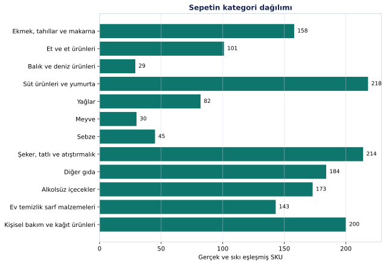
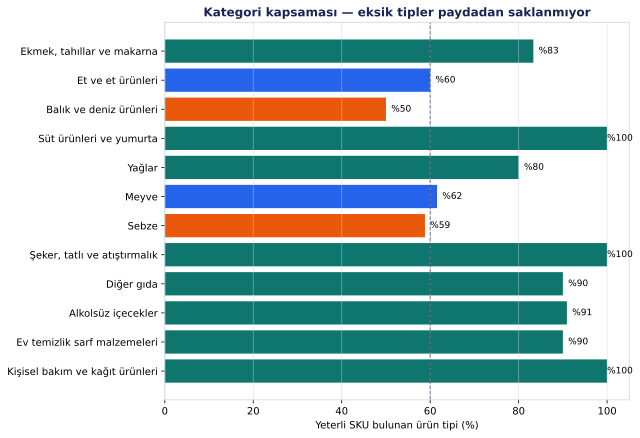

# Açık Sepet

Markette fiyatlar gerçekten ne kadar oynuyor? “Bana öyle geliyor” kısmını bilgisayara bırakan, günlük ve açık bir market fiyat endeksi.

[](https://github.com/onurcan-b/acik-sepet/actions/workflows/daily.yml)
[](https://github.com/onurcan-b/acik-sepet/actions/workflows/validate.yml)


> Bu resmî TÜFE değil. Kira, ulaşım, sağlık, eğitim ve hizmetler yok. Burada yalnızca market rafındaki malların fiyat hareketini olabildiğince temiz ve denetlenebilir biçimde ölçüyoruz.



<!-- STATS_START -->
| Endeks | Tarih | Aktif tip | Endeks SKU | Kategori kapsaması | 7 gün | 30 gün | Baz |
|---:|---|---:|---:|---:|---:|---:|---|
| **100.00** | 2026-09-02 | 106 | 1816 | %100 | — | — | 2026-09-02 = 100 |
<!-- STATS_END -->

## Kısaca ne yapıyor?

130 ürün tipi tanımlı: ekmek, kıyma, muz, domates, şampuan, çöp torbası… Her tip için birden fazla gerçek ürün ve market/depot fiyatı izleniyor. Paketler kg, litre veya adede çevriliyor; fiyat relatifleri önce ürün tipine, sonra 12 ana kategoriye, en son Açık Sepet endeksine çıkıyor.



Modelin hoşumuza gitmeyen ürünü dışarı atmasını ummuyoruz: eşleştirme tamamen deterministik. Aynı veri ve aynı kurallar, aynı sonucu verir. LLM yok.

## v0.4 neden yeniden 100’den başladı?

v0.3’te başlık eşleştirmesi fazla cömertti. “Muz” ararken muzlu gofret, “çilek” ararken reçel, “salatalık” ararken turşu panele girebiliyordu. Paket fiyatı ve matematik doğru olsa bile ölçülen ürün yanlışsa sonuç da yanlış olur.

v0.4 bu yüzden eski seriyi makyajlamıyor. **2026-09-02 = 100** ile temiz bir baseline açıyor; v0.3 verileri `data/v0.3/` altında olduğu gibi kalıyor.

Yeni eşleştirme sırası:

1. Market Fiyatı’nın `menu_category`, `main_category` veya `sub_category` filtresi uygulanır.
2. Başlıktaki bütün zorunlu kelime kuralları geçmek zorundadır. Yarım eşleşme yok.
3. Hariç kelimeler sert veto verir.
4. Miktarda önce API’nin `refinedVolumeOrWeight` alanı, gerekirse başlık parser’ı kullanılır.
5. Hesaplanan birim fiyat, API’nin `unitPriceValue` alanıyla ayrıca karşılaştırılır.
6. Yeterli gerçek SKU yoksa ürün tipi yayımlanmaz. Boşluğu yanlış ürünle doldurmak yasak.

Kategori eşlemeleri açıkça [`config/api_categories.json`](config/api_categories.json), başlık ve eşik kuralları [`config/product_types.tsv`](config/product_types.tsv) içinde.

## Sepetin içi



<!-- CATEGORY_TABLE_START -->
| Kategori | Endeks | Yeterli tip | Kapsama | SKU |
|---|---:|---:|---:|---:|
| Ekmek, tahıllar ve makarna | 100.00 | 9/12 | %75 | 155 |
| Et ve et ürünleri | 100.00 | 8/10 | %80 | 131 |
| Balık ve deniz ürünleri | 100.00 | 4/6 | %67 | 39 |
| Süt ürünleri ve yumurta | 100.00 | 13/13 | %100 | 261 |
| Yağlar | 100.00 | 4/5 | %80 | 98 |
| Meyve | 100.00 | 8/13 | %62 | 33 |
| Sebze | 100.00 | 11/17 | %65 | 58 |
| Şeker, tatlı ve atıştırmalık | 100.00 | 11/12 | %92 | 246 |
| Diğer gıda | 100.00 | 10/10 | %100 | 218 |
| Alkolsüz içecekler | 100.00 | 10/11 | %91 | 225 |
| Ev temizlik sarf malzemeleri | 100.00 | 8/10 | %80 | 159 |
| Kişisel bakım ve kağıt ürünleri | 100.00 | 10/11 | %91 | 216 |
<!-- CATEGORY_TABLE_END -->

## Kapsama dürüstlüğü

v0.3 kategori kapsamasını yalnızca baseline’da hayatta kalan ürün tipleri üzerinden hesaplıyordu. Bu, örneğin altı balık tipinden ikisi kalmışken kategoriyi `%100` gösterebiliyordu. v0.4’te payda, konfigürasyondaki bütün ürün tipleri. Eksik olan gerçekten eksik görünüyor.



<!-- GAPS_START -->
**24 ürün tipi** minimum eşiğin altında. Yanlış ürünle doldurulmadılar; endekse girmiyorlar.

| Ürün tipi | Gözlenen | Minimum | API kategori filtresi |
|---|---:|---:|---|
| Duş jeli | 0 | 7 | Duş Jelleri |
| Kahvaltılık gevrek | 0 | 6 | Kahvaltılık Gevrek Bar ve Granola |
| Dondurma | 2 | 7 | Dondurmalar |
| Meyve suyu | 3 | 8 | Meyve Suyu |
| Temizlik bezi | 0 | 5 | Temizlik Bezleri |
| Toz çamaşır deterjanı | 2 | 7 | Toz Deterjanlar |
| Tavuk göğüs | 1 | 5 | Tavuk Göğüs |
| Tost ekmeği | 2 | 5 | Tost Ekmeği |
| Balık parmak | 0 | 2 | Balık Kroket |
| Brokoli | 0 | 2 | Karnabahar ve Brokoli |
| Buğday unu | 4 | 6 | Buğday Unu |
| Cherry domates | 0 | 2 | Domates |
| Ispanak | 0 | 2 | Yeşillikler |
| Karnabahar | 0 | 2 | Karnabahar ve Brokoli |
| Kivi | 0 | 2 | Kivi |
| Konserve sardalya | 0 | 2 | Deniz Ürünleri |
| Mandalina | 0 | 2 | Narenciye |
| Çilek | 0 | 2 | Çilek |

Tabloda en zayıf 18 tip var; toplam eksik tip sayısı 24.
<!-- GAPS_END -->

## Bugün ne oynadı?

<!-- MOVERS_START -->
İkinci gözlemden sonra günlük hareketler burada belirecek. Baseline gününde dramatik hikâye çıkarmıyoruz.
<!-- MOVERS_END -->

## Veri kalitesi

<!-- QUALITY_START -->
- **1839** sıkı eşleşmiş SKU, **7** market etiketi
- **1660/1839** miktar doğrudan API'nin normalize alanından
- **1839/1839** satırda birim fiyat API değeriyle ayrıca kontrol edildi
- **1839/1839** gözlem sabit depot relatifleriyle bağlı
- **0** bridge edilmiş panel yenilemesi (yeni baseline'da doğal olarak sıfır)
<!-- QUALITY_END -->

Her günlük çalışmada şunlar da kontrol ediliyor:

- aynı SKU veya panel slotu iki ürün tipine yazılmış mı,
- paket fiyatı / miktar = birim fiyat mı,
- API birim fiyatıyla fark `%5` sınırını aşıyor mu,
- ürün başlığı hâlâ zorunlu kuralları geçiyor mu,
- API kategori etiketi beklenen eşlemeyle aynı mı,
- ürün tipi ve toplam SKU kapsaması yayın eşiğini koruyor mu.

## Endeksin kısa matematiği

Bir SKU’nun aynı depotları zaman içinde izlenir. Yeni bir depot sessizce fiyat seviyesine eklenmez; geçici kaybolan bir depot da sırf kompozisyon değişti diye sıçrama üretmez.

```text
depot_relative(s,t) = price(s,t) / price(s,anchor)
linked_package_price(t) = anchor_median × geometric_mean(depot_relative)
unit_price(t) = linked_package_price(t) / package_quantity(t)
type_index(t) = 100 × geometric_mean(unit_price(t) / unit_price(base))
```

Kalıcı kaybolan SKU’lar günlük rastgele ikame edilmez. Panel uzun süre zayıf kalırsa, birkaç gün üst üste görülen yeni aday eski slotun son fiyat seviyesine bridge edilerek alınabilir. Marka değişimi fiyat değişimi diye yazılmaz.

Ayrıntılı ve daha sıkıcı tarafı: [`METHOD.md`](METHOD.md).

## Dosyalar

```text
config/
├── api_categories.json   # Market Fiyatı kategori eşlemeleri
├── product_types.tsv     # başlık, birim ve SKU eşikleri
└── categories.json       # araştırma ağırlıkları

data/v0.4/
├── snapshots/YYYY-MM-DD.csv
├── type_indices.csv
├── category_indices.csv
├── index.csv
└── latest-errors.json

state/v0.4-panels.json    # sabit SKU/depot paneli
charts/                   # README grafikleri
```

`product_key` gerçek ürünü, `slot_id` ise zaman içinde devam eden endeks kimliğini anlatır. Ham fiyat kaynağını topluca aynalamıyoruz; yalnızca panel hesabı için gereken günlük gözlemleri saklıyoruz.

## Çalıştırmak istersen

Python 3.12+ ile:

```bash
git clone https://github.com/onurcan-b/acik-sepet.git
cd acik-sepet
python -m venv .venv
source .venv/bin/activate
pip install -r requirements.txt
pytest -q
python -m acik_sepet.collect
python -m acik_sepet.validate
python -m acik_sepet.index
python -m acik_sepet.report
```

Windows PowerShell aktivasyonu:

```powershell
.\.venv\Scripts\Activate.ps1
```

GitHub Actions her gün `05:45 UTC` için planlı. GitHub yoğun olduğunda cron’un geç başlaması mümkün; veri tarihi Türkiye saatine göre yazılıyor.

## Sınırlar

- Ağırlıklar TÜİK tüketim ağırlıkları değil; araştırma ağırlıkları.
- Mağaza/şehir örneklemi nüfusa göre tasarlanmış ulusal bir örneklem değil.
- Kampanyalar gözlenen tüketici fiyatı sayılıyor.
- Mevsimsellik, kalite değişimi ve hedonik düzeltme yok.
- Kaynak katalogdaki hatalar bize de yansıyabilir; bu yüzden kategori, başlık ve birim fiyatı ayrı ayrı kontrol ediyoruz.

Kısacası: yüksek frekanslı bir market göstergesi. Daha fazlası gibi davranmıyor.

## Kredi ve kaynak

Fiyat ve kategori verisi [Market Fiyatı](https://marketfiyati.org.tr/) arayüzünün kullandığı servisten geliyor. Market Fiyatı, [uygulamanın kendi açıklamasına göre](https://marketfiyati.org.tr/uygulama-hakkinda) **TÜBİTAK BİLGEM** tarafından geliştirildi; ilgili kamu kurumları ve fiyat verisini sağlayan zincir marketler olmasa bu çalışma da olmazdı. Kaynak verinin sahibi olduğumuzu veya onu yeniden lisansladığımızı iddia etmiyoruz.

Proje, kod ve metodoloji: **Onurcan Büyükkalkan** — [buyukkalkan.net](https://buyukkalkan.net/)

Daha net hukuk/veri notu: [`NOTICE.md`](NOTICE.md). Kod MIT lisanslı: [`LICENSE-CODE`](LICENSE-CODE).

Katkı için [`CONTRIBUTING.md`](CONTRIBUTING.md) açık. Özellikle yanlış kategori, eksik ürün tipi ve parser vakaları makbule geçer.
