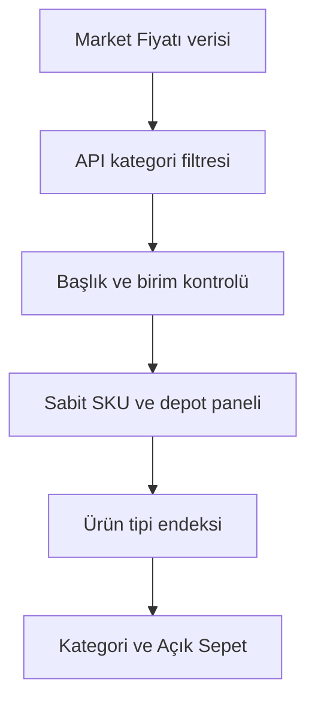

# Açık Sepet

Markette fiyatlar gerçekten ne kadar oynuyor? “Bana öyle geliyor” kısmını bilgisayara bırakan, günlük ve açık bir market fiyat endeksi.

[](https://github.com/onurcan-b/acik-sepet/actions/workflows/daily.yml)
[](https://github.com/onurcan-b/acik-sepet/actions/workflows/validate.yml)


> Bu resmî TÜFE değil. Kira, ulaşım, sağlık, eğitim ve hizmetler yok. Burada yalnızca market rafındaki malların fiyat hareketini olabildiğince temiz ve denetlenebilir biçimde ölçüyoruz.

<!-- STATUS_START -->
> **Veri durumu: Kısmi güncelleme; bazı tiplerde gün içindeki önceki ölçüm korundu.** Son seri noktası: **2026-09-17**. Kategori ağırlığı kapsaması: **%89**.
> Son tarama girişimi: 2026-09-17T13:07:32.809067+03:00.
> Aynı günün önceki ölçümü kullanılan tipler: Tost ekmeği (2026-09-17T08:20:24.040552+03:00, 2026-09-17T08:20:24.040563+03:00, 2026-09-17T08:20:24.040567+03:00, 2026-09-17T08:20:24.040569+03:00, 2026-09-17T08:20:24.040572+03:00, 2026-09-17T08:20:24.040574+03:00, 2026-09-17T08:20:24.040576+03:00, 2026-09-17T08:20:24.040578+03:00); Spagetti makarna (2026-09-17T08:20:51.222553+03:00, 2026-09-17T08:20:51.222571+03:00, 2026-09-17T08:20:51.222576+03:00, 2026-09-17T08:20:51.222581+03:00, 2026-09-17T08:20:51.222584+03:00, 2026-09-17T08:20:51.222586+03:00, 2026-09-17T08:20:51.222588+03:00, 2026-09-17T08:20:51.222590+03:00, 2026-09-17T08:20:51.222593+03:00); Yulaf ezmesi (2026-09-17T08:21:03.113254+03:00, 2026-09-17T08:21:03.113266+03:00, 2026-09-17T08:21:03.113269+03:00, 2026-09-17T08:21:03.113271+03:00, 2026-09-17T08:21:03.113274+03:00, 2026-09-17T08:21:03.113276+03:00, 2026-09-17T08:21:03.113278+03:00, 2026-09-17T08:21:03.113280+03:00, 2026-09-17T08:21:03.113282+03:00, 2026-09-17T08:21:03.113284+03:00, 2026-09-17T08:21:03.113286+03:00, 2026-09-17T08:21:03.113288+03:00); Dana kıyma (2026-09-17T08:21:06.615834+03:00, 2026-09-17T08:21:06.615845+03:00, 2026-09-17T08:21:06.615848+03:00, 2026-09-17T08:21:06.615851+03:00, 2026-09-17T08:21:06.615853+03:00); Tavuk but / baget (2026-09-17T08:21:11.764712+03:00, 2026-09-17T08:21:11.764723+03:00, 2026-09-17T08:21:11.764727+03:00, 2026-09-17T08:21:11.764729+03:00, 2026-09-17T08:21:11.764731+03:00); Bütün piliç (2026-09-17T08:21:13.357691+03:00, 2026-09-17T08:21:13.357703+03:00, 2026-09-17T08:21:13.357706+03:00, 2026-09-17T08:21:13.357709+03:00, 2026-09-17T08:21:13.357711+03:00, 2026-09-17T08:21:13.357713+03:00, 2026-09-17T08:21:13.357715+03:00, 2026-09-17T08:21:13.357718+03:00, 2026-09-17T08:21:13.357720+03:00, 2026-09-17T08:21:13.357721+03:00, 2026-09-17T08:21:13.357723+03:00, 2026-09-17T08:21:13.357725+03:00, 2026-09-17T08:21:13.357728+03:00, 2026-09-17T08:21:13.357730+03:00, 2026-09-17T08:21:13.357732+03:00); Köfte (2026-09-17T08:21:25.113125+03:00, 2026-09-17T08:21:25.113136+03:00, 2026-09-17T08:21:25.113139+03:00, 2026-09-17T08:21:25.113142+03:00, 2026-09-17T08:21:25.113144+03:00, 2026-09-17T08:21:25.113146+03:00, 2026-09-17T08:21:25.113149+03:00, 2026-09-17T08:21:25.113151+03:00, 2026-09-17T08:21:25.113153+03:00, 2026-09-17T08:21:25.113155+03:00, 2026-09-17T08:21:25.113157+03:00); Kaşar peyniri (2026-09-17T08:22:03.589250+03:00, 2026-09-17T08:22:03.589262+03:00, 2026-09-17T08:22:03.589265+03:00, 2026-09-17T08:22:03.589268+03:00, 2026-09-17T08:22:03.589270+03:00, 2026-09-17T08:22:03.589272+03:00, 2026-09-17T08:22:03.589274+03:00, 2026-09-17T08:22:03.589276+03:00, 2026-09-17T08:22:03.589278+03:00, 2026-09-17T08:22:03.589280+03:00, 2026-09-17T08:22:03.589282+03:00, 2026-09-17T08:22:03.589284+03:00, 2026-09-17T08:22:03.589286+03:00, 2026-09-17T08:22:03.589289+03:00, 2026-09-17T08:22:03.589291+03:00, 2026-09-17T08:22:03.589293+03:00, 2026-09-17T08:22:03.589295+03:00, 2026-09-17T08:22:03.589297+03:00, 2026-09-17T08:22:03.589299+03:00, 2026-09-17T08:22:03.589301+03:00, 2026-09-17T08:22:03.589303+03:00, 2026-09-17T08:22:03.589305+03:00, 2026-09-17T08:22:03.589307+03:00); Krem peynir (2026-09-17T08:22:07.061039+03:00, 2026-09-17T08:22:07.061051+03:00, 2026-09-17T08:22:07.061054+03:00, 2026-09-17T08:22:07.061056+03:00, 2026-09-17T08:22:07.061058+03:00, 2026-09-17T08:22:07.061060+03:00, 2026-09-17T08:22:07.061062+03:00, 2026-09-17T08:22:07.061065+03:00, 2026-09-17T08:22:07.061067+03:00, 2026-09-17T08:22:07.061069+03:00, 2026-09-17T08:22:07.061071+03:00, 2026-09-17T08:22:07.061073+03:00, 2026-09-17T08:22:07.061075+03:00, 2026-09-17T08:22:07.061077+03:00); Mozzarella (2026-09-17T08:22:07.800364+03:00, 2026-09-17T08:22:07.800375+03:00, 2026-09-17T08:22:07.800378+03:00, 2026-09-17T08:22:07.800381+03:00, 2026-09-17T08:22:07.800383+03:00); Biber (2026-09-17T08:22:33.371245+03:00, 2026-09-17T08:22:33.371257+03:00, 2026-09-17T08:22:33.371260+03:00, 2026-09-17T08:22:33.371263+03:00, 2026-09-17T08:22:33.371265+03:00, 2026-09-17T08:22:33.371267+03:00, 2026-09-17T08:22:33.371269+03:00, 2026-09-17T08:22:33.371271+03:00, 2026-09-17T08:22:33.371273+03:00); Toz şeker (2026-09-17T08:22:45.242783+03:00, 2026-09-17T08:22:45.242794+03:00, 2026-09-17T08:22:45.242797+03:00, 2026-09-17T08:22:45.242799+03:00, 2026-09-17T08:22:45.242801+03:00, 2026-09-17T08:22:45.242804+03:00, 2026-09-17T08:22:45.242806+03:00, 2026-09-17T08:22:45.242808+03:00, 2026-09-17T08:22:45.242810+03:00, 2026-09-17T08:22:45.242812+03:00, 2026-09-17T08:22:45.242814+03:00, 2026-09-17T08:22:45.242816+03:00, 2026-09-17T08:22:45.242818+03:00, 2026-09-17T08:22:45.242820+03:00, 2026-09-17T08:22:45.242822+03:00, 2026-09-17T08:22:45.242824+03:00, 2026-09-17T08:22:45.242826+03:00, 2026-09-17T08:22:45.242828+03:00, 2026-09-17T08:22:45.242830+03:00); Kuruyemiş (2026-09-17T08:23:11.642738+03:00, 2026-09-17T08:23:11.642749+03:00, 2026-09-17T08:23:11.642752+03:00, 2026-09-17T08:23:11.642755+03:00, 2026-09-17T08:23:11.642757+03:00, 2026-09-17T08:23:11.642759+03:00, 2026-09-17T08:23:11.642761+03:00, 2026-09-17T08:23:11.642763+03:00, 2026-09-17T08:23:11.642765+03:00, 2026-09-17T08:23:11.642767+03:00, 2026-09-17T08:23:11.642769+03:00, 2026-09-17T08:23:11.642771+03:00, 2026-09-17T08:23:11.642773+03:00, 2026-09-17T08:23:11.642775+03:00); Çözünebilir kahve (2026-09-17T08:23:56.541769+03:00, 2026-09-17T08:23:56.541780+03:00, 2026-09-17T08:23:56.541784+03:00, 2026-09-17T08:23:56.541786+03:00, 2026-09-17T08:23:56.541788+03:00, 2026-09-17T08:23:56.541791+03:00, 2026-09-17T08:23:56.541793+03:00); Kola (2026-09-17T08:24:05.269603+03:00, 2026-09-17T08:24:05.269614+03:00, 2026-09-17T08:24:05.269617+03:00, 2026-09-17T08:24:05.269619+03:00, 2026-09-17T08:24:05.269621+03:00, 2026-09-17T08:24:05.269624+03:00, 2026-09-17T08:24:05.269626+03:00, 2026-09-17T08:24:05.269628+03:00, 2026-09-17T08:24:05.269630+03:00, 2026-09-17T08:24:05.269632+03:00, 2026-09-17T08:24:05.269634+03:00, 2026-09-17T08:24:05.269636+03:00, 2026-09-17T08:24:05.269638+03:00, 2026-09-17T08:24:05.269640+03:00, 2026-09-17T08:24:05.269642+03:00, 2026-09-17T08:24:05.269644+03:00, 2026-09-17T08:24:05.269646+03:00, 2026-09-17T08:24:05.269648+03:00, 2026-09-17T08:24:05.269650+03:00, 2026-09-17T08:24:05.269652+03:00, 2026-09-17T08:24:05.269654+03:00); Enerji içeceği (2026-09-17T08:24:40.276575+03:00, 2026-09-17T08:24:40.276586+03:00, 2026-09-17T08:24:40.276589+03:00, 2026-09-17T08:24:40.276592+03:00, 2026-09-17T08:24:40.276594+03:00, 2026-09-17T08:24:40.276596+03:00, 2026-09-17T08:24:40.276598+03:00, 2026-09-17T08:24:40.276600+03:00, 2026-09-17T08:24:40.276602+03:00, 2026-09-17T08:24:40.276604+03:00, 2026-09-17T08:24:40.276606+03:00, 2026-09-17T08:24:40.276608+03:00, 2026-09-17T08:24:40.276610+03:00, 2026-09-17T08:24:40.276612+03:00, 2026-09-17T08:24:40.276614+03:00, 2026-09-17T08:24:40.276616+03:00, 2026-09-17T08:24:40.276619+03:00, 2026-09-17T08:24:40.276621+03:00, 2026-09-17T08:24:40.276623+03:00, 2026-09-17T08:24:40.276625+03:00); Gazoz (2026-09-17T08:24:45.267464+03:00, 2026-09-17T08:24:45.267475+03:00, 2026-09-17T08:24:45.267479+03:00, 2026-09-17T08:24:45.267481+03:00, 2026-09-17T08:24:45.267483+03:00, 2026-09-17T08:24:45.267485+03:00, 2026-09-17T08:24:45.267487+03:00, 2026-09-17T08:24:45.267489+03:00, 2026-09-17T08:24:45.267491+03:00, 2026-09-17T08:24:45.267493+03:00, 2026-09-17T08:24:45.267495+03:00, 2026-09-17T08:24:45.267497+03:00, 2026-09-17T08:24:45.267499+03:00, 2026-09-17T08:24:45.267501+03:00, 2026-09-17T08:24:45.267503+03:00, 2026-09-17T08:24:45.267505+03:00, 2026-09-17T08:24:45.267508+03:00); Çamaşır suyu (2026-09-17T08:24:54.718909+03:00, 2026-09-17T08:24:54.718921+03:00, 2026-09-17T08:24:54.718924+03:00, 2026-09-17T08:24:54.718926+03:00, 2026-09-17T08:24:54.718929+03:00, 2026-09-17T08:24:54.718931+03:00, 2026-09-17T08:24:54.718933+03:00, 2026-09-17T08:24:54.718935+03:00, 2026-09-17T08:24:54.718937+03:00, 2026-09-17T08:24:54.718939+03:00, 2026-09-17T08:24:54.718941+03:00, 2026-09-17T08:24:54.718943+03:00, 2026-09-17T08:24:54.718945+03:00, 2026-09-17T08:24:54.718947+03:00, 2026-09-17T08:24:54.718949+03:00, 2026-09-17T08:24:54.718951+03:00, 2026-09-17T08:24:54.718953+03:00); Şampuan (2026-09-17T08:25:13.748113+03:00, 2026-09-17T08:25:13.748125+03:00, 2026-09-17T08:25:13.748128+03:00, 2026-09-17T08:25:13.748130+03:00, 2026-09-17T08:25:13.748132+03:00, 2026-09-17T08:25:13.748134+03:00, 2026-09-17T08:25:13.748136+03:00, 2026-09-17T08:25:13.748138+03:00, 2026-09-17T08:25:13.748140+03:00, 2026-09-17T08:25:13.748142+03:00, 2026-09-17T08:25:13.748144+03:00, 2026-09-17T08:25:13.748146+03:00, 2026-09-17T08:25:13.748148+03:00, 2026-09-17T08:25:13.748150+03:00, 2026-09-17T08:25:13.748152+03:00, 2026-09-17T08:25:13.748154+03:00, 2026-09-17T08:25:13.748156+03:00, 2026-09-17T08:25:13.748158+03:00, 2026-09-17T08:25:13.748160+03:00, 2026-09-17T08:25:13.748162+03:00, 2026-09-17T08:25:13.748164+03:00); Diş fırçası (2026-09-17T08:25:29.714011+03:00, 2026-09-17T08:25:29.714023+03:00, 2026-09-17T08:25:29.714026+03:00, 2026-09-17T08:25:29.714028+03:00, 2026-09-17T08:25:29.714031+03:00, 2026-09-17T08:25:29.714033+03:00, 2026-09-17T08:25:29.714035+03:00, 2026-09-17T08:25:29.714037+03:00, 2026-09-17T08:25:29.714039+03:00, 2026-09-17T08:25:29.714041+03:00, 2026-09-17T08:25:29.714043+03:00, 2026-09-17T08:25:29.714045+03:00, 2026-09-17T08:25:29.714047+03:00, 2026-09-17T08:25:29.714049+03:00, 2026-09-17T08:25:29.714051+03:00, 2026-09-17T08:25:29.714053+03:00, 2026-09-17T08:25:29.714055+03:00, 2026-09-17T08:25:29.714057+03:00, 2026-09-17T08:25:29.714059+03:00, 2026-09-17T08:25:29.714061+03:00, 2026-09-17T08:25:29.714063+03:00); Kağıt havlu (2026-09-17T08:25:36.225235+03:00, 2026-09-17T08:25:36.225246+03:00, 2026-09-17T08:25:36.225250+03:00, 2026-09-17T08:25:36.225252+03:00, 2026-09-17T08:25:36.225254+03:00, 2026-09-17T08:25:36.225256+03:00, 2026-09-17T08:25:36.225258+03:00, 2026-09-17T08:25:36.225260+03:00, 2026-09-17T08:25:36.225262+03:00, 2026-09-17T08:25:36.225264+03:00, 2026-09-17T08:25:36.225266+03:00, 2026-09-17T08:25:36.225268+03:00, 2026-09-17T08:25:36.225270+03:00, 2026-09-17T08:25:36.225272+03:00, 2026-09-17T08:25:36.225274+03:00, 2026-09-17T08:25:36.225276+03:00, 2026-09-17T08:25:36.225278+03:00, 2026-09-17T08:25:36.225280+03:00); Kağıt mendil (2026-09-17T08:25:38.350576+03:00, 2026-09-17T08:25:38.350588+03:00, 2026-09-17T08:25:38.350591+03:00, 2026-09-17T08:25:38.350593+03:00, 2026-09-17T08:25:38.350596+03:00, 2026-09-17T08:25:38.350598+03:00, 2026-09-17T08:25:38.350600+03:00, 2026-09-17T08:25:38.350602+03:00, 2026-09-17T08:25:38.350604+03:00). Diğer tipler son taramayla güncellendi.
> Yayımlanamayan kategoriler: Sebze.
> Baz korunuyor: **2026-09-05 = 100**. 5–14 Eylül geçmişi kilitli; sınıflandırma düzeltmeleri 15 Eylül'den itibaren geçerli.
<!-- STATUS_END -->


<!-- STATS_START -->
| Endeks | Tarih | Aktif tip | Aktif tiplerde SKU | Kategori ağırlığı kapsaması | 7 gün | 30 gün | Baz |
|---:|---|---:|---:|---:|---:|---:|---|
| **99.91** | 2026-09-17 | 105 | 1439 | %89 | -0.87% | — | 2026-09-05 = 100 |
<!-- STATS_END -->

## Kısaca ne yapıyor?

130 ürün tipi tanımlı: ekmek, kıyma, muz, domates, şampuan, çöp torbası… Her tip için birden fazla gerçek ürün ve market/depot fiyatı izleniyor. Paketler kg, litre veya adede çevriliyor; fiyat relatifleri önce ürün tipine, sonra 12 ana kategoriye, en son Açık Sepet endeksine çıkıyor.



Modelin hoşumuza gitmeyen ürünü dışarı atmasını ummuyoruz: eşleştirme tamamen deterministik. Aynı veri ve aynı kurallar, aynı sonucu verir. LLM yok.

## v0.4 neden yeniden 100’den başladı?

v0.3’te başlık eşleştirmesi fazla cömertti. “Muz” ararken muzlu gofret, “çilek” ararken reçel, “salatalık” ararken turşu panele girebiliyordu. Paket fiyatı ve matematik doğru olsa bile ölçülen ürün yanlışsa sonuç da yanlış olur.

v0.4 bu yüzden eski seriyi makyajlamıyor. ilk olarak 2 Eylül’de temiz bir baseline açtı; 5 Eylül sıfırlamasıyla **2026-09-05 = 100** üzerinden devam ediyor; v0.3 verileri `data/v0.3/` altında olduğu gibi kalıyor.

Yeni eşleştirme sırası:

1. Market Fiyatı’nın `menu_category`, `main_category` veya `sub_category` filtresi uygulanır.
2. Başlıktaki bütün zorunlu kelime kuralları geçmek zorundadır. Yarım eşleşme yok.
3. Hariç kelimeler sert veto verir.
4. Miktarda önce API’nin `refinedVolumeOrWeight` alanı, gerekirse başlık parser’ı kullanılır.
5. Hesaplanan birim fiyat, API’nin `unitPriceValue` alanıyla ayrıca karşılaştırılır.
6. Yeterli gerçek SKU yoksa ürün tipi yayımlanmaz. Boşluğu yanlış ürünle doldurmak yasak.

Kategori eşlemeleri açıkça [`config/api_categories.json`](config/api_categories.json), başlık ve eşik kuralları [`config/product_types.tsv`](config/product_types.tsv) içinde.

## Sepetin içi


<!-- CATEGORY_TABLE_START -->
| Kategori | Endeks | Yeterli tip | Kapsama | SKU |
|---|---:|---:|---:|---:|
| Ekmek, tahıllar ve makarna | 100.70 | 10/12 | %83 | 147 |
| Et ve et ürünleri | 102.55 | 7/10 | %70 | 97 |
| Balık ve deniz ürünleri | 109.10 | 4/6 | %67 | 33 |
| Süt ürünleri ve yumurta | 99.46 | 13/13 | %100 | 202 |
| Yağlar | 101.72 | 4/5 | %80 | 63 |
| Meyve | 100.61 | 8/13 | %62 | 32 |
| Sebze | — | 9/17 | %53 | 44 |
| Şeker, tatlı ve atıştırmalık | 100.60 | 12/12 | %100 | 209 |
| Diğer gıda | 99.48 | 9/10 | %90 | 167 |
| Alkolsüz içecekler | 99.48 | 10/11 | %91 | 178 |
| Ev temizlik sarf malzemeleri | 98.16 | 9/10 | %90 | 130 |
| Kişisel bakım ve kağıt ürünleri | 96.15 | 10/11 | %91 | 196 |
<!-- CATEGORY_TABLE_END -->

## Kapsama dürüstlüğü

v0.3 kategori kapsamasını yalnızca baseline’da hayatta kalan ürün tipleri üzerinden hesaplıyordu. Bu, örneğin altı balık tipinden ikisi kalmışken kategoriyi `%100` gösterebiliyordu. v0.4’te payda, konfigürasyondaki bütün ürün tipleri. Eksik olan gerçekten eksik görünüyor.


<!-- GAPS_START -->
**25 ürün tipi** yeterli gözlem veya ortak panel bağlantısı olmadığı için yayımlanamadı. Tarama hataları ve kaynak güncelliği ayrıca raporlanır.

| Ürün tipi | Gözlenen | Minimum | API kategori filtresi |
|---|---:|---:|---|
| Meyve suyu | 0 | 8 | Meyve Suyu |
| Beyaz ekmek | 0 | 5 | Somun Ekmek |
| Tavuk göğüs | 0 | 5 | Tavuk Göğüs |
| Toz çamaşır deterjanı | 2 | 7 | Toz Deterjanlar |
| Hindi eti | 1 | 4 | Hindi Eti |
| Konserve sebze | 2 | 5 | Mısır Konservesi |
| Balık parmak | 0 | 2 | Balık Kroket |
| Brokoli | 0 | 2 | Karnabahar ve Brokoli |
| Cherry domates | 0 | 2 | Domates |
| Islak mendil | 5 | 7 | Islak Mendil |
| Ispanak | 0 | 2 | Yeşillikler |
| Karnabahar | 0 | 2 | Karnabahar ve Brokoli |
| Kivi | 0 | 2 | Kivi |
| Marul | 0 | 2 | Yeşillikler |
| Mısırözü yağı | 0 | 2 | Mısırözü Yağı |
| Tam buğday ekmeği | 3 | 5 | Tam Buğday Ekmeği |
| Çilek | 0 | 2 | Çilek |
| Havuç | 1 | 2 | Kök Sebzeler |

Tabloda en zayıf 18 tip var; toplam eksik tip sayısı 25.
<!-- GAPS_END -->

## Bugün ne oynadı?

<!-- MOVERS_START -->
2026-09-16 → 2026-09-17: **19 yukarı**, **21 aşağı**, **64 değişim gözlenmedi**. Karşılaştırılan tip: 104. Kaynak güncelliği aşağıda ayrıca gösterilir.

| Ürün tipi | SKU | Değişim |
|---|---:|---:|
| Helva | 17 | -6.27% |
| Bulaşık makinesi tableti | 9 | +5.69% |
| Karpuz | 3 | -4.30% |
| Şampuan | 21 | -3.25% |
| Filtre kahve | 19 | -3.13% |
| Yumurta | 16 | -3.00% |
| Kültür mantarı | 4 | -2.90% |
| Bisküvi | 22 | -2.30% |
| Elde bulaşık deterjanı | 14 | +2.21% |
| Köfte | 11 | +2.05% |
<!-- MOVERS_END -->

## Veri kalitesi

<!-- QUALITY_START -->
- **1198/1498** SKU için en yeni kaynak tarihi gözlem günüyle aynı; ayrıntı: [health.json](data/v0.4/health.json)
- **1498** sıkı eşleşmiş SKU, **7** market etiketi
- **1355/1498** miktar doğrudan API'nin normalize alanından
- **1498/1498** satırda birim fiyat API değeriyle ayrıca kontrol edildi
- **1498/1498** gözlem sabit depot relatifleriyle bağlı
- **1240/1498** SKU yalnızca bir depot üzerinden izleniyor; market etiketleri ulusal temsiliyet sağlamaz
- **1498/1498** SKU için depot fiyatları, kaynak tarihleri ve bağlantı girdileri saklanıyor (15 Eylül'den itibaren)
- **136** bridge edilmiş panel yenilemesi (yeni baseline'da doğal olarak sıfır)
<!-- QUALITY_END -->

Her günlük çalışmada şunlar da kontrol ediliyor:

- aynı SKU veya panel slotu iki ürün tipine yazılmış mı,
- paket fiyatı / miktar = birim fiyat mı,
- API birim fiyatıyla fark `%5` sınırını aşıyor mu,
- ürün başlığı hâlâ zorunlu kuralları geçiyor mu,
- API kategori etiketi beklenen eşlemeyle aynı mı,
- ürün tipi ve toplam SKU kapsaması yayın eşiğini koruyor mu.

## Endeksin kısa matematiği

**15 Eylül kalite düzeltmesi:** Baz yine **5 Eylül 2026 = 100**. 5–14 Eylül gözlemleri ve yayımlanan tip/kategori/ana endekslerin tamamı kilitlidir; eski grafik yeniden hesaplanıp değiştirilmez. Eski sınıflandırma kusurları geçmişte kalır ve bu dönem yeni kurallarla toplanmış gibi sunulmaz.

- API hatası devam eden tarama yayımlanmaz; son başarılı snapshot ve panel state korunur. Aynı gün ciddi tip kapsaması kaybında yalnızca ilgili tipin önceki ölçümü ve gerçek tarama zamanı korunur; diğer tipler güncellenir. Minimumu bozmayan tek SKU kaybı tüm yayını durdurmaz. Hata durumu grafiğin üzerinde görünür ve günlük workflow başarısız biter.
- Beyaz ekmekte kepekli/çok tahıllı/aromalı ekmekler; genel süt panelinde laktozsuz ve aromalı sütler dışarıda bırakılır. Dana kuşbaşı, bütün piliç ve normal domates tanımları da daraltılır. Yanlış eşleşen slotlar üç günlük aday teyidinden sonra kontrollü ikameye alınabilir; ilk ikame fiyat farkı hareket üretmez.
- Her yeni SKU gözleminde kullanılan depot fiyatları, kaynak tarihleri ve zincir hesabının önceki fiyat/seviye girdileri saklanır ve bağlı fiyat bunlardan yeniden doğrulanır.
- Kategori ağırlığı kapsaması, ürün kapsamıyla aynı ölçü değildir. Eksik kategoriler ve tek depot üzerinden izlenen ürünlerin payı açıkça raporlanır.

**5 Eylül düzeltmesi:** İlk 25 sonuç sınırı 200'e çıktı. “Ekmeği”, “unu”, “jeli” gibi Türkçe çekimler artık gerçek ürünü elemek için sebep değil. Eksilen SKU/depotların geçmiş fiyat farkını endeksten silen kompozisyon hatası da düzeltildi.

Her adım iki ölçümde ortak kalan kimlikleri karşılaştırır:

```text
SKU fiyatı(t) = önceki bağlı fiyat × geo_mean(ortak depot fiyat değişimleri)
Tip endeksi(t) = önceki endeks × geo_mean(ortak slot birim fiyat değişimleri)
Kategori / ana endeks(t) = önceki endeks × ağırlıklı_mean(ortak üyelerin endeks değişimleri)
```

Bir ürünün veya kategorinin kaybolması, önceki zamlarını geri almaz. Yeni gelen ürün ilk bağlantıda fiyat değişimi üretmez. Yeterli ortak gözlem yoksa o nokta yayımlanmaz; eksik fiyatı tahmin edip gerçek gözlem diye yazmıyoruz. Bunun bedeli: ürünün kayıp olduğu aralıktaki hareketi kaçırabiliriz.

**5 Eylül = 100:** Grafik 5 Eylül’de yeniden başlatıldı; daha eski gözlemler saklanıyor. Ham günlük gözlemler silinmedi. Önceki hesaplar [`revisions/pre-2026-09-05-method/`](data/v0.4/revisions/pre-2026-09-05-method/) altında. Eski snapshot'lar depot bazında tüm fiyatları saklamadığından geçmiş depot kompozisyon hatası tam olarak yeniden hesaplanamaz; depot düzeltmesi yeni ölçümlerle devreye giriyor.

Kaynak güncellenmemişse rapor bunu açıkça gösterir. “7 gün” ve “30 gün” gerçekten takvim günüdür; ilgili günün ölçümü yoksa oran da yoktur. Aynı gün yeniden taramada önceki snapshot arşivlenir; baseline üzerine yazılmaz.

Ayrıntı: [`METHOD.md`](METHOD.md).

## Dosyalar

```text
config/
├── api_categories.json   # Market Fiyatı kategori eşlemeleri
├── product_types.tsv     # başlık, birim ve SKU eşikleri
└── categories.json       # araştırma ağırlıkları

data/v0.4/
├── snapshots/YYYY-MM-DD.csv
├── type_indices.csv
├── category_indices.csv
├── index.csv
└── latest-errors.json

state/v0.4-panels.json    # sabit SKU/depot paneli
charts/                   # README grafikleri
```

`product_key` gerçek ürünü, `slot_id` ise zaman içinde devam eden endeks kimliğini anlatır. Ham fiyat kaynağını topluca aynalamıyoruz; yalnızca panel hesabı için gereken günlük gözlemleri saklıyoruz.

## Çalıştırmak istersen

Python 3.12+ ile:

```bash
git clone https://github.com/onurcan-b/acik-sepet.git
cd acik-sepet
python -m venv .venv
source .venv/bin/activate
pip install -r requirements.txt
pytest -q
python -m acik_sepet.collect
python -m acik_sepet.validate
python -m acik_sepet.health
python -m acik_sepet.index
python -m acik_sepet.report
```

Windows PowerShell aktivasyonu:

```powershell
.\.venv\Scripts\Activate.ps1
```

Kod değişiklikleri de test ve tarama akışını başlatır. GitHub Actions **8 saatte bir**, `05:17 / 13:17 / 21:17 UTC` için planlı (**Türkiye: 08:17 / 16:17 / 00:17**). Kaynak fiyatlar değişmediyse yeni bir fiyat hareketi üretilmez. Günlük grafikte her günün son başarılı taraması kullanılır; baz günü sabit tutulur. GitHub yoğun olduğunda cron’un geç başlaması mümkün; veri tarihi Türkiye saatine göre yazılıyor.

## Sınırlar

- Ağırlıklar TÜİK tüketim ağırlıkları değil; araştırma ağırlıkları.
- Mağaza/şehir örneklemi nüfusa göre tasarlanmış ulusal bir örneklem değil.
- Kampanyalar gözlenen tüketici fiyatı sayılıyor.
- Mevsimsellik, kalite değişimi ve hedonik düzeltme yok.
- Kaynak katalogdaki hatalar bize de yansıyabilir; bu yüzden kategori, başlık ve birim fiyatı ayrı ayrı kontrol ediyoruz.

Kısacası: yüksek frekanslı bir market göstergesi. Daha fazlası gibi davranmıyor.

## Kredi ve kaynak

Fiyat ve kategori verisi [Market Fiyatı](https://marketfiyati.org.tr/) arayüzünün kullandığı servisten geliyor. Market Fiyatı, [uygulamanın kendi açıklamasına göre](https://marketfiyati.org.tr/uygulama-hakkinda) **TÜBİTAK BİLGEM** tarafından geliştirildi; ilgili kamu kurumları ve fiyat verisini sağlayan zincir marketler olmasa bu çalışma da olmazdı. Kaynak verinin sahibi olduğumuzu veya onu yeniden lisansladığımızı iddia etmiyoruz.

Proje, kod ve metodoloji: **Onurcan Büyükkalkan** — [buyukkalkan.net](https://buyukkalkan.net/)

Daha net hukuk/veri notu: [`NOTICE.md`](NOTICE.md). Kod MIT lisanslı: [`LICENSE-CODE`](LICENSE-CODE).

Katkı için [`CONTRIBUTING.md`](CONTRIBUTING.md) açık. Özellikle yanlış kategori, eksik ürün tipi ve parser vakaları makbule geçer.
