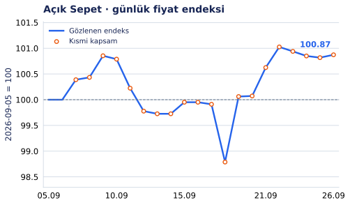
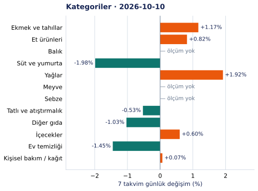
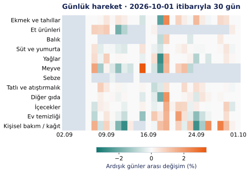
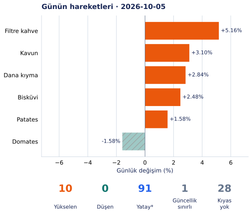
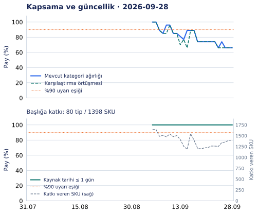
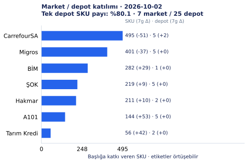

# Açık Sepet

Türkiye'de market ürünlerinin günlük fiyat hareketini izleyen açık, deneysel gösterge.

<!-- STATUS_START -->
> **Veri durumu: Eksik kapsam.** Son seri noktası: **2026-10-01**. Kategori ağırlığı kapsaması: **%81**. Güncel kaynak (≤1 gün): **%100.0**.
> **Kalite uyarısı: kapsama.** [Ayrıntı](data/v0.4/quality.json).
> Yayımlanamayan kategoriler: Meyve; Sebze.
> Baz: **2026-09-05 = 100**.
<!-- STATUS_END -->

Turuncu boş noktalar kısmi kapsamı; çizgideki boşluklar yayımlanamayan günleri gösterir.

<!-- STATS_START -->
| Endeks | Günlük | 7 gün | 30 gün | Bazdan beri |
|---:|---:|---:|---:|---:|
| **101.67** | +0.00% | +0.81% | — | +1.67% |

**%81** kategori ağırlığı · **88 tip / 1525 SKU** başlığa katkı · **1622 SKU** toplandı.
<!-- STATS_END -->

### Kategorilerde son yedi gün

“—” ilgili takvim tarihinde ölçüm olmadığını belirtir. Taralı çubuklarda kaynak güncelliği sınırlı veya bilinmiyor.

### Gün gün fiyat hareketi

Turuncu artış, yeşil azalış, beyaz sıfıra yakın hareket; gri karşılaştırma yok. Noktalı hücrelerde kaynak güncelliği sınırlı veya bilinmiyor.

### Bugün ne değişti?

En fazla beş artış ve beş azalış gösterilir. *Yatay*: her iki günde en az %90 güncel kaynakla ±%0,005 içinde hareket; güncelliği sınırlı kıyaslar ayrı sayılır. “Kıyas yok” paydasında eksik ürün tipleri de bulunur.

### Ölçümün sağlığı

Payda tüm sepet; eksik kategoriler çıkarılmaz. Güncellik, başlığa katkı veren SKU'ların kaynak tarihidir. %90 çizgisi operasyonel uyarı eşiğidir; temsiliyet garantisi değildir.

### Market ve depot katılımı

Başlığa katkı veren gözlemler gösterilir; parantezler yedi takvim günlük sayısal farktır. Depot, kaynaktaki mağaza kimliğidir; önceki kanıt yoksa fark “—” olur. Katılım sayıları ulusal temsiliyeti göstermez.

---

130 ürün tipi, 12 kategori; kg, litre veya adet başına karşılaştırılabilir fiyatlar. Grafikler her başarılı günlük taramayla güncellenir; baz ve yayımlanmış geçmiş korunur.

**Sınırlar:** Resmî TÜFE değildir. Kira ve hizmetler yoktur; ağırlıklar araştırma amaçlıdır, mağaza örneklemi nüfusa göre kurulmamıştır. Kampanyalar gözlenen fiyatın parçasıdır. Eksik kapsamda kalan kategoriler tüm market sepetini temsil etmeyebilir.

[Veri](data/v0.4/) · [Kalite tanıları](data/v0.4/quality.json) · [Yöntem](METHOD.md) · [Kurulum ve katkı](CONTRIBUTING.md) · [Günlük iş akışı](https://github.com/onurcan-b/acik-sepet/actions/workflows/daily.yml)

### Teşekkür ve kaynak

Fiyat ve kategori verisi [Market Fiyatı](https://marketfiyati.org.tr/) servisinden gelir. [Uygulamanın açıklamasına göre](https://marketfiyati.org.tr/uygulama-hakkinda) geliştirici **TÜBİTAK BİLGEM**'dir. İlgili kamu kurumlarına ve fiyat verisini sağlayan zincir marketlere teşekkürler. Kaynak verinin mülkiyeti ve lisansı ilgili hak sahiplerindedir.

Proje, kod ve metodoloji: **Onurcan Büyükkalkan** — [buyukkalkan.net](https://buyukkalkan.net/).
[Veri ve hukuk notu](NOTICE.md) · [Kod: MIT](LICENSE-CODE)
